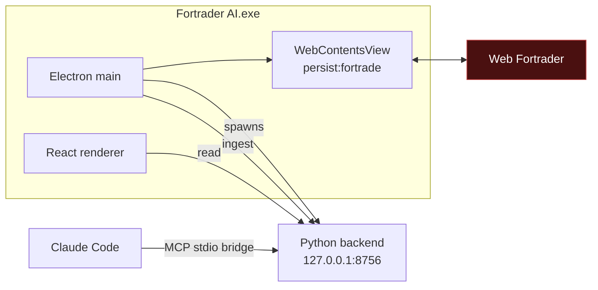

# Fortrader AI

A desktop application for Windows and macOS that embeds Web Fortrader,
reads the market and account data the authenticated session already
receives, and runs deterministic technical analysis over it in Python.

**Research only.** It cannot place, modify or close trades. See
[docs/security.md](docs/security.md) for how that is enforced.

Free and open source under the [MIT licence](LICENSE) — free to use, copy,
modify and redistribute, with no warranty.

```
Double-click Fortrader AI
        ↓
Web Fortrader loads inside the application
        ↓
Log in normally · session persists
        ↓
Analysis engine starts automatically
        ↓
Dashboard + read-only MCP tools for Claude Code
```

No external Chrome. No `--remote-debugging-port`. No separately started
Python process.

## Status

All phases are complete: embedded session, live extraction, candle
history, indicators, signal scoring, multi-timeframe analysis, SQLite
persistence, backtesting, paper trading, MCP tools, and installers for
Windows and macOS. Detail in [future-planning.md](future-planning.md).

**What it cannot yet tell you is whether any of it works.** The score has
never been calibrated against outcomes, backtests so far produced 16–17
trades against a 20-trade reporting floor, and the paper record is only
just accumulating. The application reports that honestly rather than
filling the gap with numbers — statistics are withheld below the
threshold, not estimated.

The macOS build now builds and runs on Apple Silicon. It is unsigned, so
a *downloaded* copy is refused by Gatekeeper until the quarantine flag is
cleared — see [Installing on macOS](#installing-on-macos). Intel Macs
remain untested.

## Quick start

```bash
npm install
python -m pip install -r requirements-dev.txt
npm run dev
```

Full setup notes, including the `ELECTRON_RUN_AS_NODE` trap when launching
from a VS Code terminal, are in [docs/development.md](docs/development.md).

## How it fits together



Electron owns the browser session and performs extraction. The Python
backend owns all calculation and storage. The MCP bridge is a thin
forwarder so Claude Code can query the running application.

Detail: [docs/architecture.md](docs/architecture.md) ·
[docs/data-flow.md](docs/data-flow.md)

## Authentication

You log into Fortrade through the real Web Fortrader interface, inside the
embedded view. The application never sees, prompts for or stores your
username or password.

Chromium persists the session in a dedicated `persist:fortrade` partition
under Electron's user-data directory, so you stay logged in across
restarts for as long as Fortrade's own session allows.

## MCP integration

`mcp_bridge/server.py` is a stdio bridge exposing read-only tools to Claude
Code:

`fortrade_system_status` · `fortrade_get_account` ·
`fortrade_list_symbols` · `fortrade_get_quote` · `fortrade_get_quotes` ·
`fortrade_get_positions` · `fortrade_get_candles` ·
`fortrade_candle_coverage` · `analyse_market` · `get_latest_signal` ·
`analyse_multiple_timeframes` · `get_recent_signals` · `run_backtest` ·
`get_backtest_result` · `list_backtest_runs`

`get_paper_positions`

Paper positions are **simulated**. They are never placed with Fortrade and
have no effect on the live account.

The signal `score` is a conviction summary, **not a probability or win
rate** — no calibration against outcomes has been performed. The tool
descriptions say so, so the model does not present it as one.

There is deliberately **no** `open_trade`, `close_trade`, `modify_trade`,
`place_order`, `buy` or `sell` tool. Claude acts as a research assistant
and explanation layer, not as the component doing numerical work — the
backend computes indicators deterministically so the model consumes
numbers rather than producing them.

The bridge holds no state. It discovers the running application through the
`runtime.json` the desktop app publishes on startup, and returns a clean
error if the app is not running:

> Fortrader AI is not currently running. Start the Fortrader AI desktop
> application and try again.

It fails in about a second rather than hanging.

The bridge is the backend executable run with `--mcp`, so an installed
copy needs no Python and no source tree. **Setup → Connect Claude Code**
in the app resolves the paths for your machine and offers to add the
entry to your `.claude.json`; it merges rather than replaces, and nothing
is written without an explicit click.

## Releasing

```bash
# bump "version" in desktop/package.json, then
git tag v0.2.0 && git push origin v0.2.0
```

GitHub Actions runs the full test suite, builds the sidecar and installer,
verifies both the backend and the MCP bridge actually start, and publishes
the release. Free on GitHub's tier; see
[docs/development.md](docs/development.md#shipping-an-update-to-users).

## Updates

Installed copies check GitHub Releases on launch and every six hours,
download in the background, and wait for you to press **Restart &
update** — never restarting on their own. The Python backend ships inside
the app, so it updates with it.

The download is checksum-verified, but the build is unsigned, so the
channel does not prove *who* published a release. Fine for a small trusted
group; see [docs/security.md](docs/security.md#auto-update) before wider
distribution.

## Tests

```bash
npm run check
```

Runs TypeScript typecheck, ESLint, Vitest, mypy (strict), Ruff and pytest.

The Python suite runs against captured fixtures and never touches a real
Fortrade account.

## Installing on macOS

Open the `.dmg` and drag **Fortrader AI** to Applications. Then, before
first launch, open Terminal and run:

```bash
xattr -dr com.apple.quarantine "/Applications/Fortrader AI.app"
```

It prints nothing when it works. Skip it and macOS says:

> “Fortrader AI” is damaged and can’t be opened. You should move it to
> the Bin.

Nothing is damaged. There is no Apple Developer ID behind this build, and
that is the message macOS shows for an app it cannot attribute to a
certified developer. The command removes the “downloaded from the
internet” marker so macOS stops asking Apple about it; it needs no
password and touches nothing else.

Right-click → Open and System Settings → Privacy & Security → **Open
Anyway** are the usual workarounds and neither applies here — macOS
offers them only for apps that do carry a developer certificate. The
`.dmg` ships a `READ ME FIRST.txt` repeating all of this.

Only run that command on software you trust. For this app, that means a
`.dmg` from
[the releases page](https://github.com/AviralK98/fortrader-ai/releases).

## Building an installer

```powershell
npm run package:all     # Windows -> release/Fortrader AI Setup <version>.exe
```
```bash
npm run package:mac     # macOS   -> release/Fortrader AI-<version>-<arch>.dmg
```

Each bundles the Electron app with a PyInstaller-built backend, so **end
users need neither Python nor Node**. Windows installs per-user with no
admin prompt; macOS is drag-to-Applications.

Build each on the platform it targets — PyInstaller cannot cross-compile.

Both installers are **unsigned**. Windows SmartScreen warns on first run
until a code-signing certificate is supplied; macOS refuses to open a
downloaded build at all until its quarantine flag is cleared, as above.
Removing either warning needs a paid certificate — Windows code signing,
and the Apple Developer Program for macOS. See
[docs/development.md](docs/development.md#building-the-windows-installer).

## Disclaimer

This software analyses market data. It does not give financial advice, and
nothing it produces is a recommendation to trade.

The signal score is a measure of how much its own components agree. It has
**not** been calibrated against outcomes, so it says nothing about the
probability of any trade succeeding. Backtest and paper-trading figures
are simulations over small samples, not evidence of an edge.

Trading carries risk of loss. Any decision you take is yours, and the
software is provided without warranty of any kind — see [LICENSE](LICENSE).

## Performance

Measured on 12 September 2026 against v0.5.1 with real stored market
data, on an Intel Core i7-8750H with 16 GB RAM running Windows 11. No
competing application was benchmarked side by side apart from
MetaTrader 5's install size. Method and limits:
[docs/performance.md](docs/performance.md).

| Area | What | Fortrader AI | Compared with similar apps |
|---|---|---|---|
| **Speed** | Reading analysis that is already computed | 2–4 ms | Better or equal — far below the ~100 ms at which a response stops feeling instant |
| | Full panel refresh (10 requests, every 2 s) | 26 ms | Instant |
| | First analysis on a new chart or new bar | 57–256 ms | Instant to a brief pause |
| | User strategy script | 268 ms (first run 446 ms) | Brief pause |
| | Backend startup (installed build) | 3.1 s | Normal |
| | AI chat answer | 6 s simple, 14–22 s with market data | Comparable — the time is the model thinking |
| | Backtest, 4,750 one-minute bars | **58 s** (range 50–90 s) | **Weak spot** — see below |
| **Resources** | Memory, window visible | 426 MB | Heavier than a native terminal such as MT5; typical of an Electron app |
| | ↳ Fortrade's web terminal page | ~187 MB | A browser tab runs the same page |
| | ↳ Electron runtime (main, GPU, network) | 117 MB | |
| | ↳ Python analysis backend | 69 MB | |
| | ↳ Interface | 53 MB | |
| | CPU, window visible | 0.3% of the machine (3.9% of one core) | Comparable |
| | CPU, minimised | ~0% | Comparable |
| | Installer | 137 MB Windows, 154 MB macOS | Heavier |
| | Installed on disk | 470 MB | Heavier — MetaTrader 5 is 313 MB |
| **Data** | Price delay behind Fortrade | Up to 2 s (1.2 s measured) | Behind native terminals, which react to every tick. Fine for analysis on one-minute charts and up; not for scalping |

**Verdict.** Comparable for everyday use: fast where it is noticed, and
heavier on memory and disk than a native terminal, as expected for an
Electron app with a Python backend. Backtesting is the one area that is
genuinely poor, because the engine rebuilds every indicator for every bar.

### Compared with AI trading tools

No competing AI tool was benchmarked: each row sets the measurements above
against how such tools are built. Detail:
[docs/ai-tools-comparison.md](docs/ai-tools-comparison.md).

| Area | Fortrader AI | Typical AI trading tools | On par? |
|---|---|---|---|
| Getting analysis or a signal | 2–4 ms, calculated on your PC | Calculated on their servers, so every request makes a trip over the internet | **Yes, faster.** Nothing sent over the internet can match 2–4 ms on your own PC |
| AI chat | 6–22 s, with nothing on screen until the whole answer is ready | Similar total time, but words appear as they are written | **Behind in feel.** A blank wait feels much slower than watching the answer type out |
| Backtesting (replaying a strategy on past prices) | 58 s for 4,750 bars | Their testers do not rebuild every indicator on every bar, so a test this size is light work | **No.** The clear weak spot |
| Live prices | Up to 2 s behind Fortrade | Tools with a direct market data feed update on every price change | **Behind** for fast trading; fine on one-minute charts and slower |
| Memory and disk | 426 MB memory, 470 MB installed | Web tools run in a browser tab; desktop tools are similar | **On par** for a desktop app |
| How good the predictions are | Not proven; the 0–100 score is not a win rate | Many advertise win rates, usually from their own tests | **Unknown for both.** Fortrader AI claims no win rate, and there is no fair side-by-side test yet |

## Cost

Nothing in this project requires payment:

| | |
|---|---|
| Every dependency | Open source — Electron, React, Python, pandas, FastAPI, SQLite, PyInstaller, electron-builder |
| Release hosting and updates | GitHub Releases |
| CI builds | GitHub Actions free tier |
| Fortrade demo account | Free |

The one optional cost is a **code-signing certificate** (~£200/year
commercially), which removes the Windows SmartScreen warning and proves
who published an update. Without it everything still works — users click
"More info → Run anyway" once.

If this repository is public, free code-signing programmes exist for open
source projects (SignPath Foundation is the usual route; check their
current eligibility rules). Certum also sells inexpensive open-source
certificates. Neither is required to use or share the app.

## Repository layout

See [docs/development.md](docs/development.md#layout). Proof-of-concept
scripts from the Playwright/CDP era are preserved in
[legacy/prototypes/](legacy/prototypes/) with notes on what superseded
them.
