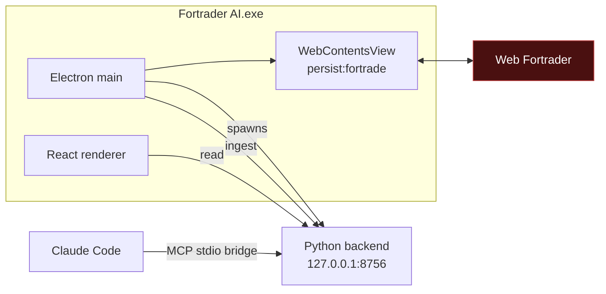

# Fortrader AI

A Windows desktop application that embeds Web Fortrader, reads the market
and account data the authenticated session already receives, and runs
deterministic technical analysis over it in Python.

**Research only.** It cannot place, modify or close trades. See
[docs/security.md](docs/security.md) for how that is enforced.

```
Double-click Fortrader AI
        ↓
Web Fortrader loads inside the application
        ↓
Log in normally · session persists
        ↓
Analysis engine starts automatically
        ↓
Dashboard + read-only MCP tools for Claude Code
```

No external Chrome. No `--remote-debugging-port`. No separately started
Python process.

## Status

Phase A (foundation) and Phase B (embedded authenticated session) are
working. The application launches, starts its own backend, hosts Web
Fortrader in an Electron `WebContentsView`, and persists the login across
restarts.

Phase C onward — reading account and quote data into the native dashboard,
candle history, indicators, signals, backtesting, paper trading, packaging
— is tracked in [future-planning.md](future-planning.md).

The analysis panel deliberately shows no numbers yet. Placeholder scores
would be indistinguishable from wrong ones.

## Quick start

```bash
npm install
python -m pip install -r requirements-dev.txt
npm run dev
```

Full setup notes, including the `ELECTRON_RUN_AS_NODE` trap when launching
from a VS Code terminal, are in [docs/development.md](docs/development.md).

## How it fits together



Electron owns the browser session and performs extraction. The Python
backend owns all calculation and storage. The MCP bridge is a thin
forwarder so Claude Code can query the running application.

Detail: [docs/architecture.md](docs/architecture.md) ·
[docs/data-flow.md](docs/data-flow.md)

## Authentication

You log into Fortrade through the real Web Fortrader interface, inside the
embedded view. The application never sees, prompts for or stores your
username or password.

Chromium persists the session in a dedicated `persist:fortrade` partition
under Electron's user-data directory, so you stay logged in across
restarts for as long as Fortrade's own session allows.

## MCP integration

`mcp_bridge/server.py` is a stdio bridge exposing read-only tools to Claude
Code:

`fortrade_system_status` · `fortrade_get_account` ·
`fortrade_list_symbols` · `fortrade_get_quote` · `fortrade_get_quotes` ·
`fortrade_get_positions` · `fortrade_get_candles` ·
`fortrade_candle_coverage` · `analyse_market` · `get_latest_signal` ·
`analyse_multiple_timeframes` · `get_recent_signals` · `run_backtest` ·
`get_backtest_result` · `list_backtest_runs`

`get_paper_positions`

Paper positions are **simulated**. They are never placed with Fortrade and
have no effect on the live account.

The signal `score` is a conviction summary, **not a probability or win
rate** — no calibration against outcomes has been performed. The tool
descriptions say so, so the model does not present it as one.

There is deliberately **no** `open_trade`, `close_trade`, `modify_trade`,
`place_order`, `buy` or `sell` tool. Claude acts as a research assistant
and explanation layer, not as the component doing numerical work — the
backend computes indicators deterministically so the model consumes
numbers rather than producing them.

The bridge holds no state. It discovers the running application through the
`runtime.json` the desktop app publishes on startup, and returns a clean
error if the app is not running:

> Fortrader AI is not currently running. Start the Fortrader AI desktop
> application and try again.

It fails in about a second rather than hanging.

`.mcp.json` in this repository points Claude Code at the bridge. Nothing
rewrites your Claude configuration silently.

## Tests

```bash
npm run check
```

Runs TypeScript typecheck, ESLint, Vitest, mypy (strict), Ruff and pytest.

The Python suite runs against captured fixtures and never touches a real
Fortrade account.

## Building a Windows installer

```powershell
npm run package:all
```

Produces `release/Fortrader AI Setup <version>.exe` (~133 MB): the Electron
app plus a PyInstaller-built `fortrader-backend.exe`, so **end users need
neither Python nor Node**. Per-user install, no admin prompt.

The installer is currently **unsigned** — Windows SmartScreen will warn on
first run until a code-signing certificate is supplied. See
[docs/development.md](docs/development.md#building-the-windows-installer).

## Repository layout

See [docs/development.md](docs/development.md#layout). Proof-of-concept
scripts from the Playwright/CDP era are preserved in
[legacy/prototypes/](legacy/prototypes/) with notes on what superseded
them.
