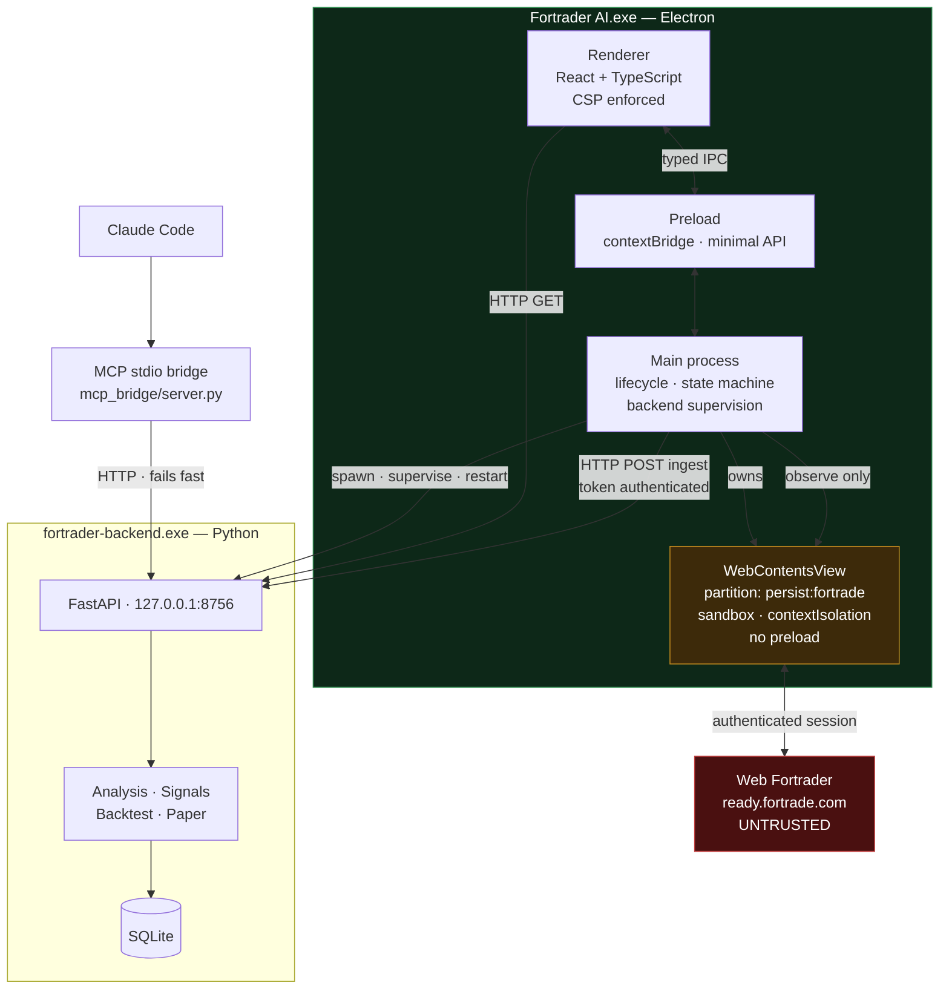
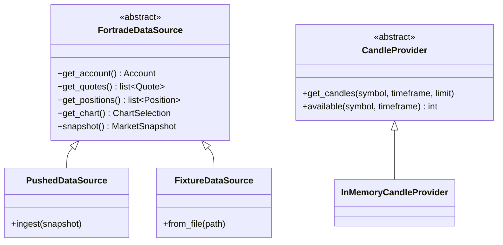
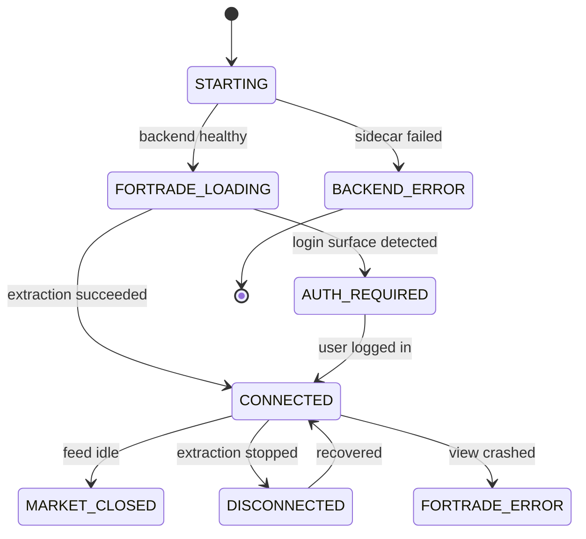

# Architecture

Fortrader AI is a Windows desktop application that embeds Web Fortrader,
reads the data the authenticated browser session already receives, and runs
deterministic analysis over it in Python.

It is **read-only research software**. It cannot place, modify or close
trades.

## Process model

Three processes, one of which the user never sees.

The red boundary is the trust boundary. Everything crossing it from
Fortrade is untrusted input and is validated before use.

Note the arrows around the Fortrade view: data flows **out** only. Nothing
in the analysis path, and nothing reachable from Claude Code, has a route
back into the trading interface.

## Why an embedded WebContentsView

The proof of concept drove an external Chrome over the DevTools protocol on
port 9222. That required the user to launch Chrome with command-line flags
and keep it alive alongside a separate Python process.

`WebContentsView` removes all of that. It is Electron's current
recommendation for hosting a top-level web view — `BrowserView` is
deprecated and the `<webview>` tag is discouraged. An iframe would not work
regardless: Fortrade sets framing restrictions, and an iframe would share
our renderer's origin and session.

The view uses a dedicated `persist:fortrade` partition, so Chromium's own
cookie jar keeps the session across restarts. We never see or store the
password.

## Component responsibilities

| Component | Owns | Must not |
|---|---|---|
| `desktop/main` | Windows, the Fortrade view, backend lifecycle, app state | Contain analysis logic |
| `desktop/preload` | The `contextBridge` surface | Expose Node or filesystem |
| `desktop/renderer` | Presentation | Parse Fortrade markup |
| `backend/fortrade` | Normalised models, parsers, source abstraction | Know about React or IPC |
| `backend/analysis` | Indicators and scoring | Know about Fortrade selectors |
| `backend/analysis/indicators.py` | Pure maths over pandas | Perform I/O or know about candles |
| `backend/storage` | SQLite schema and migrations | Contain business rules |
| `mcp_bridge` | Forwarding to the backend | Compute anything |

The rule that keeps this honest: **Fortrade-specific selectors never leave
`backend/fortrade` and the extraction script in `desktop/main`.** Analysis
code sees only `Candle`, `Quote`, `Account` and `Position`.

## Data source abstraction

`FortradeDataSource` has no write method. Order entry is not disabled by a
flag — it has no representation in the type system, and a test asserts
that.

`PushedDataSource` is fed by the desktop shell. `FixtureDataSource` parses a
captured page dump so the test suite never touches a real account.

## Application state

`CONNECTED` is only reachable through successful extraction. A URL alone is
never treated as proof of a working session, because it isn't one.

Every snapshot carries `captured_at`, and the status endpoint reports
`data_age_seconds` and `stale`. The UI shows staleness rather than
implying that an old number is live.

## Phase status

| Phase | Scope | State |
|---|---|---|
| A | Foundation, project layout, app launches | Done |
| B | Embedded Fortrade, persistent session | Working |
| C | Account, quotes, chart into our UI | Done — position rows blocked |
| D | Historical candle extraction | Done — collection is user-driven |
| E | Deterministic indicators | Done |
| F | Signal scoring, multi-timeframe | Done |
| G | SQLite persistence of snapshots and signals | Done |
| H | Backtesting | Done — sample still too small to calibrate |
| I | Paper trading | Done — simulated only |
| J | MCP bridge | Foundation working |
| K | Windows installer | Done — unsigned |
