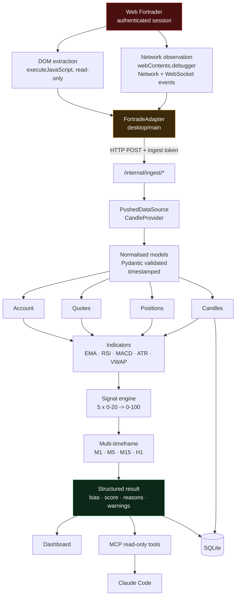

# Data flow

## Runtime path



## Direction of travel

Data moves in one direction: Fortrade to adapter to models to analysis to
presentation. There is no return path.

This is structural. The Electron main process holds the only reference to
the Fortrade `webContents`, and it exposes no IPC channel, HTTP route or
MCP tool that sends input into that view. Claude Code sits at the far end
of a chain whose every link is a read.

## Ingest is authenticated

The desktop shell generates a random token at launch and passes it to the
backend through the environment. `POST /internal/ingest/*` requires it as
`X-Ingest-Token`.

Without this, any local process could inject fabricated market data into
the analysis pipeline and the resulting signals would be meaningless. The
token check runs as a FastAPI dependency, which resolves **before** body
validation, so an unauthenticated caller gets `401` and learns nothing
about the schema.

The public `/api/*` routes are read-only and unauthenticated — they only
expose data the user is already looking at.

## Freshness

Every model carries `captured_at`. `PushedDataSource` records when the last
snapshot arrived, and `/api/status` reports:

- `last_snapshot_at`
- `data_age_seconds`
- `stale` — true beyond a 15 second threshold

The status strip renders "Live · 2s ago" or "Stale · 47s old". It never
shows a bare number that might be minutes out of date.

An empty positions list is a real observation, not missing data — a flat
account is meaningful. `PushedDataSource` therefore always replaces
positions on ingest, while leaving absent account/quote/chart sections
untouched.

## Candle acquisition

The prototype could read one visible OHLC bar from the chart legend. That
is not a history.

Web Fortrader loads its chart data over HTTP:

```
GET https://api.fortrade.com/.../api/charts/{SYMBOL}/{MINUTES}/slim

{ "symbol": "GBPUSD`",
  "points": [ { "T": "2026-08-28T12:39:00Z",
                "O": 1.35755, "H": 1.35761,
                "L": 1.35731, "C": 1.35731 }, ... ] }
```

Roughly 500 bars per request, with ISO-8601 UTC timestamps — so no
timezone has to be inferred. `CandleCapture` attaches
`webContents.debugger` to the view we already host and reads these
responses as they arrive.

Live quotes additionally stream over a SignalR WebSocket
(`wss://…/signalr/connect`, method `SendMetaDataQuotes`). Not consumed yet.

### Strictly passive

The capture observes. It never issues a request, replays one, crafts one,
or touches an endpoint the page did not call itself.

Explicitly not done:

- bypassing authentication
- circumventing access controls
- probing undocumented endpoints
- reconstructing or invoking private trading endpoints
- synthesising bars by dragging the chart

**The consequence is real and is not hidden:** a series exists only once
the user has opened that chart. `/api/candles/coverage` reports exactly
what is held, the UI names which timeframes are missing, and
`CandlesResponse.sufficient` is false whenever fewer bars are held than
requested. Insufficient data is reported, never fabricated.

### Normalisation

| Concern | Handling |
|---|---|
| Symbol | `GBPUSD\`` → `GBP/USD` via the map read from the DOM, which also covers names like GOLD |
| Interval | URL minutes → `Timeframe` (1→M1, 5→M5, 15→M15, 60→H1, …) |
| Forming bar | `complete: false` until bar open + interval has elapsed |
| Bad bars | Dropped: missing fields, unparseable time, or `high < low` |
| Duplicates | Unique on `(symbol, timeframe, timestamp)`; re-observation updates, and a closed bar never reverts to forming |
